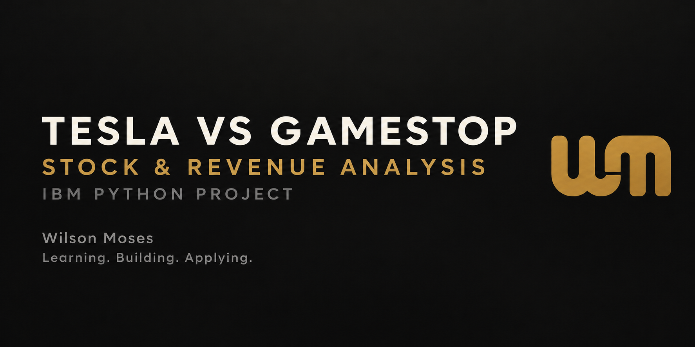
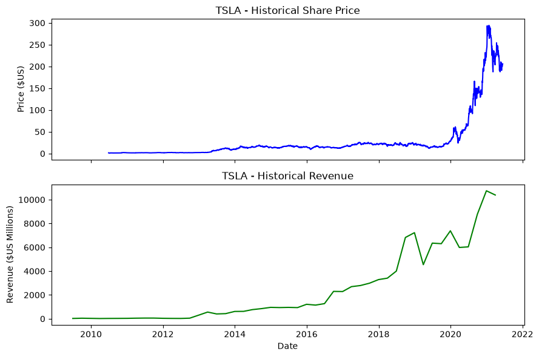
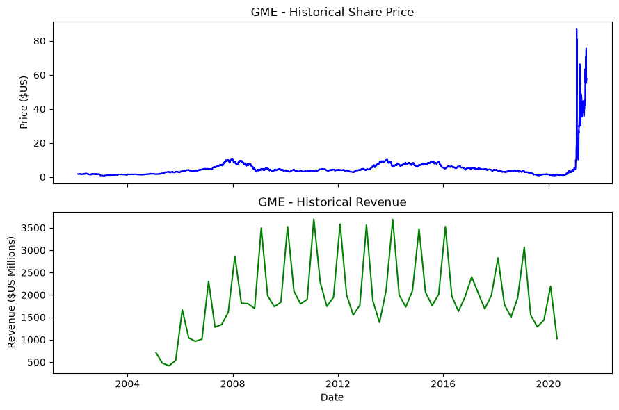

<p align="center">
  
</p>

# Stock and Revenue Analysis: Tesla vs GameStop

> An IBM Data Science Professional Certificate project using Python to extract, clean, and visualize historical market data.

[](https://www.python.org/)
[](https://jupyter.org/)
[](https://www.coursera.org/professional-certificates/ibm-data-science)

### [View the completed analysis notebook →](stock_revenue_analysis.ipynb)

## Project overview

This project compares the historical share prices and quarterly revenues of **Tesla (TSLA)** and **GameStop (GME)**. It combines financial-data extraction and web scraping in a reproducible Python workflow, then presents both measures in aligned visualizations.

The notebook demonstrates how market price movements can be assessed alongside company revenue rather than viewed in isolation.

## Objectives

- Extract historical share-price data with `yfinance`.
- Scrape quarterly revenue tables with `requests` and `BeautifulSoup`.
- Clean and structure the extracted records with `pandas`.
- Visualize price and revenue trends with `Matplotlib`.
- Compare market behaviour with underlying business performance.

## Analysis workflow

| Stage | Implementation |
|---|---|
| Data collection | Download TSLA and GME price histories and retrieve course-hosted revenue pages |
| Web scraping | Locate the relevant HTML tables and extract quarterly records |
| Data preparation | Reset indexes, remove currency symbols and commas, and filter missing values |
| Visualization | Plot historical share price and revenue on aligned time-series charts |
| Interpretation | Compare how closely each company's price movement reflects its revenue pattern |

## Results

### Tesla



Tesla's share price and quarterly revenue both rose substantially over the period shown, with especially strong acceleration approaching 2021.

### GameStop



GameStop's 2021 share-price surge was not accompanied by a comparable sustained rise in revenue. This descriptive contrast shows why stock price alone is not a complete measure of business performance.

## Repository structure

```text
ibm-stock-revenue-analysis/
├── assets/
│   ├── gamestop-stock-revenue.png
│   ├── project-banner.png
│   └── tesla-stock-revenue.png
├── stock_revenue_analysis.ipynb
├── requirements.txt
└── README.md
```

## Run the notebook

1. Clone this repository and enter its directory.
2. Create and activate a Python virtual environment.
3. Install the dependencies:

   ```bash
   pip install -r requirements.txt
   ```

4. Open `stock_revenue_analysis.ipynb` in Jupyter Notebook, JupyterLab, or PyCharm Professional and run the cells in order.

The notebook retains its key outputs so the analysis can also be reviewed directly on GitHub.

## Skills demonstrated

`Python` · `Pandas` · `yfinance` · `Beautiful Soup` · `Web Scraping` · `Data Cleaning` · `Time-Series Visualization` · `Jupyter Notebook`

## Academic context

Completed as part of the **Python Project for Data Science** course in the IBM Data Science Professional Certificate. The analysis is presented here as evidence of practical learning; the explanatory framing and repository presentation have been adapted for Wilson Moses's data science portfolio.

Data is sourced through `yfinance` and IBM Skills Network course-hosted pages. Results are educational and should not be interpreted as financial advice.

---

<p align="center">
  <strong>Wilson Moses</strong><br>
  Data Scientist × AI Engineer in Development<br>
  <em>Learning. Building. Applying.</em><br><br>
  <a href="https://github.com/WilsonMoses-Data">GitHub Profile</a> ·
  <a href="https://www.linkedin.com/in/wilson-moses-9207b22bb">LinkedIn</a>
</p>
